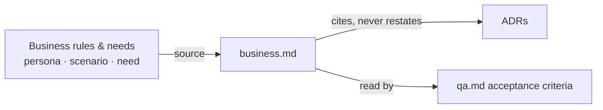

# Writing a ScrumIA feature

A feature is not a document, it's a **directory of targeted files**. Each file has a role and a reader. Beyond the three this module mandates, you only create one if it has something to say.

## Why a catalog rather than a fixed template

This is a preference, not a truth. It comes from a usage finding: a fixed template produces empty sections filled with "N/A", which nobody cleans up and everybody reloads. You then no longer know whether "N/A" means "not applicable" or "not thought through yet".

The catalog moves the problem: **the absence of an optional file becomes information**. No `legal.md` means "nothing legal at stake", asserted rather than omitted. It works because it is bounded: `index.md`, `qa.md` and `CHANGELOG.md` are mandatory, so their absence stays a gap rather than a claim — a feature nobody can find, follow over time, or test is not a feature. That mandatory set is this module's own, declared in `references/catalog.md`; another module at the `specs` slot may require a different one.

In exchange, it demands a bit more judgment at writing time — that's the price to pay, and it doesn't suit every team.

## The TDD angle

This module treats `qa.md` as the central document, not as an appendix. Acceptance criteria are written **before** implementation and directly become the tests.

Concretely:

- A criterion carries a stable identifier (`AC-1`, `AC-2`) that test code references.
- A ticket cites the `AC-n` it satisfies; a PR shows the criterion → test mapping.
- A criterion that cannot fail is not a criterion. "The user must have a good experience" cannot be tested.
- When a behavior changes, `qa.md` changes first — the contradiction then surfaces before being encoded in code, where fixing it costs the least.

This is what makes a spec verifiable rather than declarative. If you prefer a less structured approach, this module is not for you — and that's precisely why it's replaceable.

## The two strata

- **`features/business/<feature>/`** — the *what*. Business value, business rules. No screens, no API, no tech. This is the EPIC.
- **`features/app/<app>/<feature>/`** — the *how* of **a single** app. References its parent Business feature, and possibly other App features (frontend → backend).

An App feature with no Business parent is suspect: either it's purely technical (accepted, say so explicitly in its `index.md`), or the Business feature is missing.

## The catalog

`references/catalog.md` details each file, its content, its reader, and when it is expected. **Read it before creating a feature.** Ready-to-fill templates in `assets/`.

In short:

| File | Business | App Backend | App Frontend |
|---|---|---|---|
| `index.md` | **mandatory** | **mandatory** | **mandatory** |
| `business.md` | **mandatory** — the rules, personas, value, journey-as-intent | **mandatory** — this app's value + reference to the parent | **mandatory** — this app's value + reference to the parent |
| `qa.md` | **mandatory** | **mandatory** | **mandatory** |
| `CHANGELOG.md` | **mandatory** | **mandatory** | **mandatory** |
| `legal.md` | if personal data, payment, user content, regulated sector, or a named legal risk | same | same |
| `archi.md` | if the EPIC touches ≥2 apps | no | no |
| `api-contract.md` | if it shares data across a feature boundary | often | if it consumes a contract |
| `tech.md` | no | often | sometimes |
| `ux.md` | no | no | often — carries the accessibility prose; the testable targets are `qa.md` criteria |
| `security.md` | if a meaningful risk surface exists | same | same |
| `devx.md` | no | if it exposes a lib or an SDK | if it exposes components |

Two existence categories, declared in `references/catalog.md`: **mandatory in every
feature** (`index.md`, `qa.md`, `CHANGELOG.md`, `business.md` — every feature states
its value), **content-tested** (everything else). Two absolute rules travel with them:
a spec cites no ticket — only `CHANGELOG.md` points at an issue, never at a PR — and every
`business.md` opens with who the feature is for, what it brings, why it matters, and
whether that can be measured.

The catalog is open: `perf.md`, `i18n.md`, `analytics.md` are legitimate if the feature justifies them. When you add one that's not in the catalog, document it in `references/catalog.md` with its boundary in the same three-part shape — otherwise the next person will reinvent a different name for the same thing.

## `business.md`'s boundary

`business.md` is sourced from business rules and needs alone — persona, scenario, need
— and nothing else. What flows out of it differs by reader:

- `qa.md`'s acceptance criteria are downstream of `business.md`'s rules, one way only —
  `qa.md` reads `business.md`, `business.md` never reads `qa.md` back to justify a rule.
- An ADR is not always downstream. `business.md` may point to one as the live authority
  on something it states ("the type vocabulary is ADR-0017's"), and some ADRs point back
  to `business.md` for the concrete test they only decide the shape of
  (`docs/adr/0015-scope-measures-reach.md` reads `execution-policy/business.md` this way).



Either direction, the relationship with an ADR is a **pointer, not a narration**:
`business.md` never restates what an ADR decided, quotes its former wording, or explains
how the decision was reached — it names which one is current authority and stops there.

## Composition block

This module's contract with the rest of ScrumIA — see `docs/adr/0016-global-feature-index.md`, which supersedes `docs/adr/0012-specs-contract.md`. `scrumia-init` copies this block verbatim into `CLAUDE.md`'s `## Specs contract` section, between the `scrumia:start` markers. Consumers (`scrumia-ticket`, `scrumia-split`, the team agents) read it from there instead of hard-coding this module's file names; a module replacing this one at the `specs` slot must ship its own block in the same shape.

```
specs_root: features/
feature_index: index.md
global_index: index.md
acceptance_file: qa.md
ac_id_format: AC-<n>
changelog: CHANGELOG.md
catalog: business.md, legal.md, archi.md, api-contract.md, tech.md, ux.md, security.md, devx.md
```

`catalog` lists the per-feature files a consumer only expects to find sometimes. `index.md`, `qa.md` and `CHANGELOG.md` get keys of their own because consumers need a stable name for each; `global_index` names the file at the root of `specs_root` that lists every feature, generated by `tools/build_features_index.py` and gated against drift (see `docs/adr/0016-global-feature-index.md`). Keep this block in sync with `references/catalog.md` when the catalog changes, or the contract starts lying.

**This block does not declare the mandatory set, and a consumer must not infer one from it.** A key names a file, it does not require it — a module that carries a changelog without mandating it still needs a `changelog:` key, or consumers have no name to use. Of the four files this module mandates in every feature, three are named outside `catalog` (`index.md`, `qa.md`, `CHANGELOG.md`) and the fourth, `business.md`, sits inside it — a key's position says nothing about status. Which files are mandatory is `references/catalog.md`'s to declare, where this module declares its existence categories — not the contract's.

## Splitting: when one feature is really two

A feature is a **unit of value verifiable independently**. The decisive test: can you write at least one Given/When/Then scenario that validates it **without referencing another in-progress feature**? If not, it's not a feature.

Signals that splitting is needed:

- `business.md` exceeds ~200 lines, or `qa.md` ~12 scenarios
- Two groups of rules share no vocabulary
- Two parts can be delivered on different dates without breaking each other

Signals for merging (or for "it's a ticket, not a feature"):

- No business rules of its own, a single acceptance scenario → it's a **ticket** on an existing feature
- It only makes sense delivered together with another → a single feature

These thresholds are guardrails, not laws. Exceeding one calls for checking, not for splitting mechanically.

## Never put history in a spec

A spec contains only **its current version**. What that means, concretely:

**A feature file must contain:**
- The current rule or behavior, stated in the present tense
- A live ownership pointer to another spec or ADR that is the current authority on
  something the file states (e.g. "the type vocabulary is ADR-0017's") — that's
  ownership, not history
- In `qa.md` specifically: testable criteria (Given/When/Then scenarios, identified by
  `AC-n`) — the other files carry no obligation to

**A feature file must not contain:**
- Quoted or paraphrased former wording — no "formerly", no "since v2", no
  struck-through sections
- Past-tense narration of how or why a change happened — a sentence that describes the
  change instead of the current rule. "By human ruling", "retired", "absorbed", "folded
  into" are the usual tell, not an exhaustive list to pattern-match on: the same words
  read fine describing current behavior ("not folded into `Backlog`"), so judge the
  sentence, not the token
- A ticket, issue or PR number anywhere outside `CHANGELOG.md`
- A specific commit, sprint or other past event cited as evidence for why a rule now
  reads the way it does

Run this checklist on the file you're about to write, not only on review — a spec that
narrates how it got here is the most frequent defect this module's audits find (see
*Auditing a feature*, below).

History lives in three places, and only one per use:

- The feature's `CHANGELOG.md` — short, one entry per notable change, with pointers
- Commits — who changed what, when
- Issues — **why**, which alternatives, which trade-offs

The entry's format is stated once, in [`references/catalog.md`](references/catalog.md)
§ `CHANGELOG.md`, which is this feature's authority on it. A worked entry:

```markdown
## 2026-09-12 — MFA required at login
- Issue: #45
- Category: Added
- Breaking: yes — see the migration described in #45
```

The two rules that example obeys — name nothing that does not exist yet, and one entry
per category — are stated in the catalog with their reasons. Read them there.

The *why* is in `#45`, not here. A changelog entry that explains its reasoning is a spec starting to grow again.

## Writing a `qa.md` that is useful

Given/When/Then, one scenario per case. An unverifiable criterion is not a criterion: "the user must have a good experience" can neither pass nor fail, so it says nothing.

Systematically cover the nominal case, then: zero, boundary, duplicate, concurrency, cancellation, expiration, insufficient permissions. Those are the cases that produce bug tickets.

## Updating an existing feature

1. Read `index.md` first. It tells you which files exist and when to read each.
2. Modify only the files concerned.
3. If a new topic appears (the feature becomes subject to GDPR), create the file — don't slip it into `business.md`.
4. Add an entry to `CHANGELOG.md` with the linked issue.
5. If an optional file becomes meaningless, delete it — an empty file is worse than an absent one. Never a mandatory file: one that has gone thin is one to fill, not one to remove.
6. If you created, renamed or removed a feature, regenerate the global index (`python3 tools/build_features_index.py`) — validation fails on drift.

## Auditing a feature

Look for, in this order: inline history (the most frequent defect), a ticket number anywhere outside `CHANGELOG.md`, optional files that are empty or full of "N/A", a mandatory file that is missing or that exists without content, a `business.md` that states no value (who it is for, what it brings, why it matters, measured or not), unverifiable acceptance criteria, an `index.md` that no longer matches the files present, an App feature with no Business parent and no justification, an `api-contract.md` that has drifted from the code.

Return one finding per point, with the file path. Rewrite nothing without the user's agreement.
